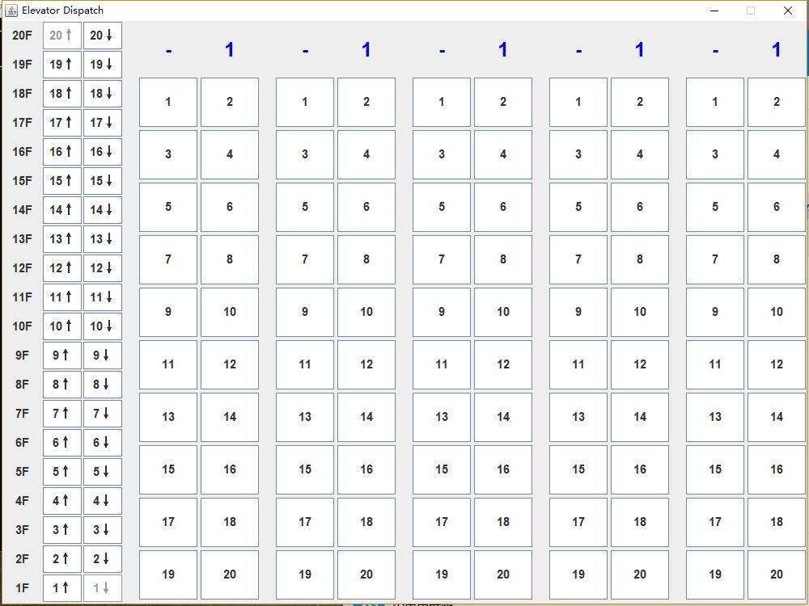
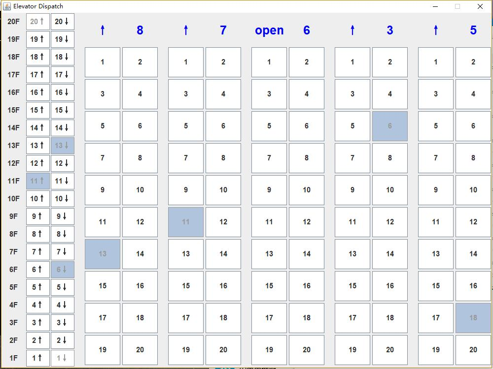

# 电梯调度

###### 操作系统第一次作业

### Author: 1753127 何立仁


## 项目介绍

### 1. 背景

- 本项目为某栋共20层，拥有五部互联电梯的楼编写电梯调度算法（楼层和电梯数可在代码中设置）

- 20层楼，每层楼有上下两个按钮（底楼的向下和顶楼的向上按钮为禁用状态）
- 5部电梯，每部电梯内部有所有楼层按钮

### 2. 开发和运行

- 使用 `java` 进行开发

- 运行：在根目录下运行命令

  - ```shell
    java -jar App.jar
    ```
    
    

## 具体实现

### 1. 电梯运行

- 电梯类拥有一个状态变量 `state` ，代表电梯运动方向，其有三个取值为 `up` 、 `down` 和 `free` 
- 电梯类还拥有一个布尔变量 `arriveFloor` ，代表电梯是否到达任务楼层，即电梯是否处于停靠状态
- 电梯内部按钮按下后将对应楼层添加为任务楼层，具体操作如下：
  - 将该楼层标记为任务楼层
  - 如果电梯处于 `free` 状态，任务楼层若大于当前楼层则置 `state` 为 `up` ，否则置为 `down` 
  - 若任务楼层等于当前楼层，则执行开门操作并修改状态（修改状态的方法在下面）
- 电梯类中计时器会每隔 **1800ms** 检查一次电梯状态，根据电梯状态执行一下四种不同的指令：
  -  `arriveFloor` 为 `true` ，则将 `arriveFloor` 置为 `false` ，并修改部分数据，执行关门操作
  - 状态为 `up` ，电梯向上一层 
  - 状态为 `down` ，电梯向下一层
  - 状态为 `free` ，执行空操作
- 电梯每向下或向上移动一层后，都会检查该层是否为本电梯的任务楼层，如果是则执行开门操作并修改状态，**修改状态** 的方法如下：
  - 若没有剩余任务，则修改状态为 `free` 
  - 若有剩余任务，且当前状态为 `up` ，判断剩余任务中最高楼层是否大于本楼层，是则继续保持 `up` 状态，否则修改状态为 `down`
  - 若有剩余任务，且当前状态为 `down` ，修改方法与上面相反即可

### 2. 调度算法

- 外部调度中，**基本思想** 为将任务转化为电梯内部任务进行调度
- 为调度准确，在电梯类中添加一个变量 `order` 代表电梯执行的外部指令的方向。即电梯在 `free` 状态接受外部任务时，`order` 取决于外部任务按钮的方向而不是电梯实际运动方向，其他情况下 `order` 与 `state` 相同
- 调度的原则如下：
  - 电梯不响应 **与其运行方向相反** （即 `state` ）的请求。例如上行的电梯不会相应向下的请求
  - 电梯不响应与其在 `free` 状态下已接受的外部指令方向（即 `order` ）相反的请求。即 **正在响应下降请求的上升电梯不响应上升请求，正在响应上升请求的下降电梯不响应下降请求**
  - **上升电梯不响应比电梯当前楼层低的上升请求，下降电梯不响应比电梯当前楼层高的下降请求**
  - 在满足上述要求的电梯中寻找 **距离最近** 的电梯，如果距离相同选择非 `free` 状态的电梯
  - 暂时不能被响应的请求加入未处理的请求任务列表中，每隔 **1000ms** 检查清理一次

### 3. 实现细节

- 电梯类 Elevator

  ```java
  public class Elevator {
      ...
      private ElevatorView view = new ElevatorView(this);
  	private boolean []floorButtonPressed = new boolean[Floor.totalFloor + 1];
  	private int []outJobDirection = new int[Floor.totalFloor + 1];
  	private Timer timer;
  	private TimerTask timerTask;
  	private Floor floorView;
  	private int state;
  	// 电梯接受外部任务后order和state可能不一致
  	private int order;
  	private int tempState;
  	private boolean changeOrder;
  	private int floor;
  	private int maxJob;
  	private int minJob;
  	private boolean arriveFloor;
      ...
  }
  ```

- 电梯类主要函数

  |       函数名       |                       作用                       |          代码位置           |
  | :----------------: | :----------------------------------------------: | :-------------------------: |
  |    void start()    | 每隔 **1800ms** 调用一次，根据状态来执行不同指令 | Elevator.java(line 199-218) |
  | void addJob(int f) |   添加任务（外部任务也会被转化为内部任务添加）   | Elevator.java(line 175-197) |
  |  void finishJob()  |    当前到达楼层为任务楼层，修改状态，完成任务    | Elevator.java(line 236-292) |

- Floor类外部调度函数

  ```java
  private boolean schedule(int floor, int direction, boolean fromLookUp) {
      int adverseDirec = Elevator.up + Elevator.down - direction;
      int distance = totalFloor + 1;
      int elevatorId = -1;
      // 寻找最合适点电梯接受该任务
      for (int i = 0; i < Elevator.totalElevator; ++i) {
          int d2 = Math.abs(floor - elevators[i].getFloor());
          // 如果电梯已经上行/下行至该楼层且不是停靠状态跳过该电梯
          // 如果电梯为非free状态且其所在楼层在要求楼层与direction相反的方向跳过该电梯
          // 如果电梯运行方向与需求方向相反则跳过该电梯
          if ( (d2 == 0 && (elevators[i].getState() == direction && !elevators[i].isPause()))
              || (elevators[i].getState() == Elevator.up && floor < elevators[i].getFloor())
              || (elevators[i].getState() == Elevator.down && floor > elevators[i].getFloor())
              || elevators[i].getState() == adverseDirec
              || elevators[i].getOrder() == adverseDirec ) {
              continue;
          }
          // 选距离更小者
          if (d2 < distance) {
              distance = d2;
              elevatorId = i;
          // 若距离相等 选择非free状态的电梯
          } else if (d2 == distance) {
              if (elevators[i].getState() == direction) {
                  elevatorId = i;
              }
          }
      }
      // 若没找到合适的电梯则将其加入任务列表
      if (elevatorId == -1) {
          if (!fromLookUp) {
              switch (direction) {
                  case Elevator.up:
                      noDispatchedJob.add(floor);
                      break;
                  case Elevator.down:
                      noDispatchedJob.add(floor + totalFloor);
                      break;
              }
          }
          return false;
      } else {
          // 若找到了合适的电梯让其接受该任务
          elevators[elevatorId].addOutJob(floo, direction);
          return true;
      }
  }
  ```


## 运行演示

- 界面截图

  

- 运行截图

  